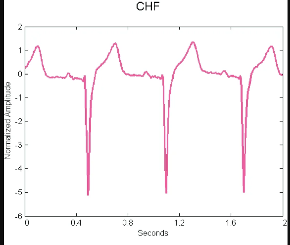

## Dataset

- 1200 observations
- Response Variable: `ECG_signal`
- Normal Sinus Rhytmn, Arrythmia, Atrial Fibrilation, Cogenital Heart Failure

```{r fig1, echo=FALSE, out.width = '90%'}

```

## Decision Tree

```{r}
#| label: setup-df
#| ref.label: !expr c("data-cleaning", "dt-packages", "dt-fit", "dt-pruning", "dt-importance-calc")
#| eval: true
#| echo: false
#| results: hide
#| message: false
#| warning: false
```

:::: {.columns}

::: {.column}
```{r}
#| label: fig-dt
#| ref.label: dt-plot
#| eval: true
#| echo: false
#| results: markup
```
:::

::: {.column}
```{r}
#| label: tbl-dt-matrix
#| ref.label: dt-confusion-matrix
#| eval: true
#| echo: false
#| results: markup
```
:::

::::

## Pruned Decision Tree

:::: {.columns}

::: {.column}
```{r}
#| label: fig-dev-size
#| ref.label: dt-dev-vs-size
#| eval: true
#| echo: false
#| results: markup
```
:::

::: {.column}
```{r}
#| label: fig-dt-prunned
#| ref.label: dt-pruned-plot
#| eval: true
#| echo: false
#| results: markup
```
:::

::::

## Random Forest

```{r}
#| label: setup-rf
#| ref.label: !expr c("data-cleaning", "rf-packages", "rf-fit", "rf-importance-calc")
#| eval: true
#| echo: false
#| results: hide
#| message: false
#| warning: false
```

:::: {.columns}

::: {.column}
```{r}
#| label: tbl-rf-matrix
#| ref.label: rf-confusion-matrix
#| eval: true
#| echo: false
#| results: markup
```
:::

::: {.column}
```{r}
#| label: fig-rf-importance
#| ref.label: rf-importance-MDA-plot
#| eval: true
#| echo: false
#| results: markup
#| fig-height: 5
```
:::

::::


```{r}
#| label: data-cleaning
#| eval: false
#| results: false
#| message: false
#| warning: false
# Import dataset, assuming file is in current working directory
ecg.df <- read.csv("ECGCvdata.csv")

# Response Variable counts
ailement_counts <- table(ecg.df$ECG_signal)
print(ailement_counts)

# Finding variables with empty values
cols_with_na <- names(ecg.df)[colSums(is.na(ecg.df)) > 0]
#print(cols_with_na)

# Dropping columns
to_drop <- c("RECORD", cols_with_na)
ecg.df <- ecg.df[, !(names(ecg.df) %in% to_drop)]

# Converting response to factor
ecg.df$ECG_signal <- as.factor(ecg.df$ECG_signal)
```

```{r}
#| label: dt-packages
#| eval: false
#| results: false
# Load necessary packages
library(tree)
library(caret)
```

```{r}
#| label: dt-fit
#| eval: false
#| results: false
# Creating variables to store MTE and confusion matrices
mte.dt <- c()
cm.dt <- list()

for(i in 1:10)
{
  set.seed(i)
  
  # Stratified 80/20 split — mirrors random forest splits exactly
  train_index.dt <- createDataPartition(ecg.df$ECG_signal, p = 0.8, list = FALSE)
  train_data.dt <- ecg.df[train_index.dt, ]
  test_data.dt  <- ecg.df[-train_index.dt, ]
  
  # Fit the full unpruned tree on training data
  ecg.tree <- tree(ECG_signal ~ ., data = train_data.dt)
  
  # Predictions and Mean Test Error on held-out test data
  predictions.dt <- predict(ecg.tree, newdata = test_data.dt, type = "class")
  mte.dt[i] <- mean(predictions.dt != test_data.dt$ECG_signal)
  
  # Store confusion matrix
  current.cm.dt <- confusionMatrix(predictions.dt, test_data.dt$ECG_signal)
  cm.dt[[i]] <- current.cm.dt$table
}
```

```{r}
#| label: dt-plot
#| eval: false
#| results: false
# Plot the pruned tree — this is the tree picture required in Results
plot(ecg.tree)
text(ecg.tree, pretty = 0, cex = 0.5)
title(main = "Decision Tree: ECG Signal Classification")
```

```{r}
#| label: dt-pruning
#| eval: false
#| results: false
# Pruning — done once on a fixed split for visualization and interpretation
set.seed(1)
train_index.prune <- createDataPartition(ecg.df$ECG_signal, p = 0.8, list = FALSE)
train_data.prune  <- ecg.df[train_index.prune, ]

# Fit full tree on training data
ecg.tree.prune <- tree(ECG_signal ~ ., data = train_data.prune)

# Cross-validation to find optimal number of terminal nodes
cv.ecg <- cv.tree(ecg.tree.prune, FUN = prune.misclass)

# Select the size with minimum CV error
best.size <- cv.ecg$size[which.min(cv.ecg$dev)]
best.size

# Override to preferred tree size based on CV plot inspection
ecg.pruned <- prune.misclass(ecg.tree.prune, best = 4)
```

```{r}
#| label: dt-dev-vs-size
#| eval: false
#| results: false

# Plot deviance vs tree size to visualize optimal pruning point
plot(cv.ecg$size, cv.ecg$dev, type = "b",
     xlab = "Number of Terminal Nodes",
     ylab = "CV Classification Error",
     main = "Cross-Validation for Tree Pruning")
```

```{r}
#| label: dt-pruned-plot
#| eval: false
#| results: false
# Plot the pruned tree — this is the tree picture required in Results
plot(ecg.pruned)
text(ecg.pruned, pretty = 0, cex = 0.7)
title(main = "Pruned Decision Tree: ECG Signal Classification")
```

```{r}
#| label: dt-accuracy-calc
#| eval: false
#| results: false
# Accuracy calculations across 10 iterations
avg.accuracy.dt <- 1 - mean(mte.dt)
sd.accuracy.dt  <- sd(1 - mte.dt)

print(paste("Average Accuracy across 10-fold split:", round(avg.accuracy.dt, 4)))
print(paste("Standard Deviation of accuracy across 10-fold split:", round(sd.accuracy.dt, 4)))
```

```{r}
#| label: dt-confusion-matrix
#| eval: false
#| results: false
# Aggregate confusion matrices across all 10 runs
total.cm.dt <- Reduce("+", cm.dt)
final.cm.dt <- confusionMatrix(total.cm.dt)
knitr::kable(total.cm.dt)
```

```{r}
#| label: rf-packages
#| eval: false
#| results: false
# Load necessary packages
library(randomForest)
library(caret)
```
```{r}
#| label: rf-fit
#| eval: false
#| results: false
# Creating variables to store variable importance, MTE, and confusion matrix
p <- ncol(ecg.df) - 1
importance.rf <- list()
mte.rf <- c();
cm.rf <- list()

for(i in c(1:10))
{

set.seed(i)

# Creating stratified data for training and test
train_index.rf <- createDataPartition(ecg.df$ECG_signal, p = 0.8, list = FALSE)
train_data.rf <- ecg.df[train_index.rf, ]
test_data.rf <- ecg.df[-train_index.rf, ]

# Fit the model
ecg.rf <- randomForest(ECG_signal ~ ., data = train_data.rf, mtry = sqrt(p), ntree = 500, importance = TRUE)

# Predictions on test data and storing Mean Test Error
predictions.rf <- predict(ecg.rf, newdata = test_data.rf)
mte.rf[i] <- mean(predictions.rf != test_data.rf$ECG_signal)

# Creating data frame for importance
importance.df <- as.data.frame(importance(ecg.rf))

# Creating a column for the variable to stop splitting of results per run
importance.df$Feature <- rownames(importance.df)

# Storing variable importance
importance.rf[[i]] <- importance.df

# Generating confusion matrix and storing the table
current.cm <- confusionMatrix(predictions.rf, test_data.rf$ECG_signal)
cm.rf[[i]] <- current.cm$table

}
```
```{r}
#| label: rf-importance-calc
#| eval: false
#| results: false
# Importance Calculations 

# Aggregate the importance score
all.importance.rf <- do.call(rbind, importance.rf)
avg.importance.rf <- aggregate(. ~ Feature, data = all.importance.rf, FUN = mean)

# Sorting the results for list of top variables
avg.importance.rf <- avg.importance.rf[order(-avg.importance.rf$MeanDecreaseAccuracy), ]
head(avg.importance.rf, 10)
```
```{r}
#| label: rf-accuracy-calc
#| eval: false
#| results: false
# Accuracy Calculations

# Averaging the accuracy across all runs
avg.accuracy.rf <- 1 - mean(mte.rf)

# Standard Deviation of accuracy across all runs
sd.accuracy.rf <- sd(1 - mte.rf)
```
```{r}
#| label: rf-confusion-matrix
#| eval: false
#| results: false
# Confusion Matrix aggregation
total.cm.rf <- Reduce("+", cm.rf)
final.cm.rf <- confusionMatrix(total.cm.rf)
knitr::kable(total.cm.rf)
```
```{r}
#| label: rf-results
#| eval: false
#| results: false
# Print results
print(paste("Average Accuracy across 10 iterations:", round(avg.accuracy.rf, 4)))
print(paste("Standard Deviation of accuracy across 10 iterations:", round(sd.accuracy.rf, 4)))
print(final.cm.rf)
```
```{r}
#| label: rf-importance-MDA-plot
#| eval: false
#| results: false
# Sorting the results to plot the average Mean Decrease Accuracy 
avg.importance.rf <- avg.importance.rf[order(avg.importance.rf$MeanDecreaseAccuracy), ]
top20.rf <- tail(avg.importance.rf, 20)
dotchart(top20.rf$MeanDecreaseAccuracy, 
         labels = top20.rf$Feature,
         cex = 0.7, 
         main = "Average Variable Importance",
         xlab = "Mean Decrease Accuracy")
```
